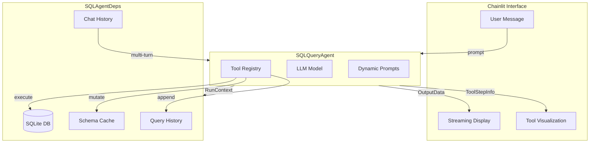

# SQL Query Agent - Building Agents with pydantic-ai

This document provides a comprehensive walkthrough of the SQL Query Agent showcase, designed for teaching pydantic-ai concepts progressively.

---

## Table of Contents

1. [Architecture Overview](#1-architecture-overview)
2. [Core Components](#2-core-components)
3. [Progressive Feature Walkthrough](#3-progressive-feature-walkthrough)
4. [Pydantic-AI Features Map](#4-pydantic-ai-features-map)
5. [Demo Scenarios](#5-demo-scenarios)
6. [Langfuse Dashboard Walkthrough](#6-langfuse-dashboard-walkthrough)
7. [Production Comparison](#7-production-comparison)
8. [Key Takeaways](#8-key-takeaways)

---

## 1. Architecture Overview

### System Flow



### Key Architectural Decisions

1. **Dependency Injection via RunContext**
   - The `SQLAgentDeps` dataclass is injected into every tool via pydantic-ai's `RunContext[T]` pattern
   - Tools can read and mutate deps, allowing state accumulation across calls
   - This is the agent's "working memory"

2. **Provider Abstraction**
   - `config.py` provides a factory function `get_model()` that abstracts away provider details
   - Switch between OpenAI, Anthropic, and Google with a single env var change
   - Settings (temperature, max_tokens, reasoning_effort) are centralized

3. **Dynamic Prompts via Instructions**
   - `instructions` callables receive `RunContext` and return strings at runtime
   - This allows injecting dynamic context (cached schemas, conversation history)
   - Keeps data and instructions co-located for better LLM comprehension

4. **Streaming Protocol**
   - Single `OutputData` model unifies all streaming events
   - Three categories: `model_request` (text), `call_tools` (tools), `final_result` (done)
   - UI and backend speak the same protocol

---

## 2. Core Components

### 2.1 Dependencies (`deps.py`)

**What to point out:**
- Dataclass with both immutable config (`db_path`) and mutable state (`schema_cache`, `query_history`)
- `async def get_connection()` shows lazy initialization pattern
- `add_to_history()` method demonstrates deps mutation for state accumulation

```python
@dataclass
class SQLAgentDeps:
    """
    Dependencies injected into every tool via RunContext.
    This is the agent's "working memory" across tool calls.
    """
    db_path: Path
    connection: aiosqlite.Connection | None = None
    schema_cache: dict[str, list[dict]] = field(default_factory=dict)
    query_history: list[dict] = field(default_factory=list)
    conversation_id: UUID = field(default_factory=uuid4)
    chat_history: list[dict] = field(default_factory=list)

    async def get_connection(self) -> aiosqlite.Connection:
        """Lazy initialization - connection created on first use."""
        if self.connection is None:
            self.connection = await aiosqlite.connect(self.db_path)
        return self.connection
```

### 2.2 Pydantic Models (`models.py`)

**What to point out:**
- `Field(description=...)` makes models self-documenting for LLMs
- The LLM reads these descriptions and understands data semantics without extra prompting
- Enums provide constrained choices

```python
class ColumnInfo(BaseModel):
    """Information about a database column."""
    
    name: str = Field(description="Column name as it appears in the database")
    data_type: str = Field(description="SQL data type (e.g., INTEGER, TEXT, REAL)")
    nullable: bool = Field(description="Whether the column allows NULL values")
    is_primary_key: bool = Field(default=False, description="Whether this is a primary key")
    description: str | None = Field(
        default=None,
        description="Human-readable description of what this column represents"
    )
```

### 2.3 Tools (`tools.py`)

**What to point out:**
- First parameter is always `RunContext[DepsType]` - auto-injected by pydantic-ai
- Docstrings become the schema the LLM sees - write them clearly!
- `ModelRetry` sends errors back to the LLM for self-correction
- Tools return Pydantic models, not dicts or strings

```python
async def describe_table(
    ctx: RunContext[SQLAgentDeps],
    table_name: str,
) -> list[ColumnInfo]:
    """
    Get detailed schema information for a specific table.

    Args:
        table_name: Name of the table to describe (e.g., 'products', 'orders')

    Returns:
        List of ColumnInfo objects with column names, types, and constraints.
    """
    # Validate table access
    if table_name not in ALLOWED_TABLES:
        # ModelRetry: Error sent back to LLM for correction
        raise ModelRetry(
            f"Table '{table_name}' is not accessible. "
            f"Allowed tables: {', '.join(sorted(ALLOWED_TABLES))}."
        )
    
    # ... execute query ...
    
    # Cache in deps for future use (deps mutation)
    ctx.deps.schema_cache[table_name] = [col.model_dump() for col in columns]
    
    return columns
```

### 2.4 Dynamic Prompts (`prompts.py`)

**What to point out:**
- `instructions` callables vs static `system_prompt`
- Runtime access to deps via `ctx.deps`
- Dynamic context injection keeps data close to instructions

```python
def get_schema_context(ctx: RunContext[SQLAgentDeps]) -> str:
    """
    Dynamically inject cached schema information into the prompt.
    
    Showcases: Runtime context injection via deps.
    """
    deps = ctx.deps
    
    if not deps.schema_cache:
        return "<schema_context>No schema loaded yet.</schema_context>"
    
    # Build schema summary from cache
    schema_lines = ["<schema_context>", "Tables you have explored:"]
    for table_name, columns in deps.schema_cache.items():
        schema_lines.append(f"\n  {table_name}:")
        for col in columns:
            schema_lines.append(f"    - {col['name']}: {col['data_type']}")
    
    schema_lines.append("</schema_context>")
    return "\n".join(schema_lines)
```

### 2.5 Provider Configuration (`config.py`)

**What to point out:**
- Single factory function abstracts all providers
- Settings mapped per model (reasoning models have different parameters)
- Easy to add new providers

```python
def get_model(
    provider: str | None = None,
    model_name: str | None = None,
) -> Model:
    """Factory function for provider-agnostic model creation."""
    provider = provider or os.getenv("LLM_PROVIDER", "openai")
    
    if provider == "openai":
        model_name = model_name or os.getenv("MODEL_NAME", "gpt-4.1")
        return OpenAIModel(model_name)
    elif provider == "anthropic":
        model_name = model_name or os.getenv("MODEL_NAME", "claude-sonnet-4-20250514")
        return AnthropicModel(model_name)
    elif provider == "google":
        model_name = model_name or os.getenv("MODEL_NAME", "gemini-2.0-flash")
        return GeminiModel(model_name)
    else:
        raise ValueError(f"Unknown provider: {provider}")
```

### 2.6 Base Agent (`base_agent.py`)

**What to point out:**
- Generic type parameters `BaseAgent[OutputType, DepsType]`
- Conditional Langfuse setup via `instrument` flag
- `stream()` yields `OutputData` events with three categories
- Message history conversion for persistence

```python
class BaseAgent(Generic[OutputType, DepsType]):
    """Base agent providing streaming and instrumentation."""

    def __init__(
        self,
        model: Any,
        *,
        system_prompt: str = "",
        tools: list | None = None,
        instructions: list | None = None,
        output_type: type[OutputType] | None = None,
        retries: int = 3,
        instrument: bool = True,
    ):
        # Setup Langfuse if requested
        if instrument:
            setup_langfuse_instrumentation()

        # Build pydantic-ai Agent
        self._agent: Agent[DepsType, OutputType] = Agent(
            model=model,
            system_prompt=system_prompt,
            output_type=output_type,
            retries=retries,
        )

        # Register tools
        for tool in (tools or []):
            self._agent.tool(tool)

        # Register instructions (dynamic prompts)
        for instruction_fn in (instructions or []):
            self._agent.instructions(instruction_fn)
```

---

## 3. Progressive Feature Walkthrough

### Level 1: Structured Output Only

**Configuration:**
```bash
DEMO_LEVEL=1
```

**What's Active:**
- No tools
- `output_type=StructuredQueryPlan`
- Agent generates SQL plans without execution

**Teaching Focus:**
- Pydantic structured output validation
- How LLM generates typed, validated data
- `Field(description=...)` for schema guidance

**Code Location:** `agent/agent.py` lines 45-50

```python
# Determine output type: structured for Level 1
if self.demo_level == 1:
    output_type = StructuredQueryPlan  # Pydantic model
```

**Try This:**
```
"Generate a query to find the top 5 customers by total spending"
```
Expected: Returns `StructuredQueryPlan` with `sql`, `tables_used`, `estimated_complexity`, `explanation`

---

### Level 2: Schema Exploration

**Configuration:**
```bash
DEMO_LEVEL=2
```

**What's Active:**
- `list_tables` tool
- `describe_table` tool
- Dynamic instructions (schema context injection)

**Teaching Focus:**
- `RunContext[SQLAgentDeps]` injection
- Deps mutation (caching schema)
- Tool docstrings as LLM schema

**Code Location:** `agent/tools.py` lines 30-90

**Try This:**
```
1. "What tables are in the database?"
2. "Describe the products table"
3. "What columns does the orders table have?"
```
Expected: Agent explores schema, each call populates `deps.schema_cache`

---

### Level 3: Full Query Execution

**Configuration:**
```bash
DEMO_LEVEL=3
```

**What's Active:**
- All Level 2 tools
- `execute_query` tool
- `get_current_date` tool
- `get_stock_query_template` tool

**Teaching Focus:**
- Tool orchestration (agent chooses which tools to call)
- Query history accumulation
- Template/retriever pattern

**Code Location:** `agent/tools.py` lines 95-200

**Try This:**
```
1. "Show me products that are below their reorder point"
2. "What were the top selling products last month?"
3. "Use the stock template to find critical inventory"
```
Expected: Agent executes real SQL queries, results displayed in markdown tables

---

### Level 4: Full Agent Mode

**Configuration:**
```bash
DEMO_LEVEL=4
ENABLE_LANGFUSE=true
```

**What's Active:**
- All Level 3 tools
- ModelRetry error recovery (3 retries)
- Streaming with tool visualization
- Langfuse tracing

**Teaching Focus:**
- Error recovery patterns
- Streaming protocol
- Observability

**Code Location:** `agent/base_agent.py` lines 80-150

**Try This:**
```
# Trigger ModelRetry - invalid table
"Show me data from the secret_table"

# Trigger ModelRetry - SQL syntax error  
"SELECT * FROM products WEHRE stock < 10"

# Trigger ModelRetry - empty results
"Show me orders from Antarctica"
```
Expected: Agent receives error, corrects itself, and retries

---

## 4. Pydantic-AI Features Map

| Feature | File | Lines | What to Point Out |
|---------|------|-------|-------------------|
| **RunContext Injection** | `tools.py` | L30-35, L65-70 | First param `ctx: RunContext[SQLAgentDeps]` auto-injected |
| **ModelRetry** | `tools.py` | L75-80, L145-160 | `raise ModelRetry(message)` sends error to LLM |
| **Field(description=...)** | `models.py` | L20-50 | Self-documenting models for LLM interpretation |
| **Structured Output** | `agent.py` | L45-50 | `output_type=StructuredQueryPlan` |
| **instructions Callables** | `prompts.py` | L10-80 | Runtime prompt generation with deps access |
| **system_prompt vs instructions** | `agent.py` | L55-60 | Static vs dynamic prompt patterns |
| **Tool Registration** | `base_agent.py` | L65-70 | `self._agent.tool(tool)` loop |
| **Streaming** | `base_agent.py` | L90-150 | `async with agent.run_stream()` pattern |
| **OutputData Protocol** | `models.py` | L120-150 | Unified event model with categories |
| **Provider Factory** | `config.py` | L40-70 | `get_model()` abstracts providers |
| **Langfuse Setup** | `base_agent.py` | L20-40 | Conditional `logfire.instrument_pydantic_ai()` |
| **Deps Mutation** | `tools.py` | L85-90 | `ctx.deps.schema_cache[table_name] = ...` |
| **Chat History** | `deps.py` | L25-30 | Multi-turn via `chat_history` field |
| **Message Conversion** | `base_agent.py` | L160-190 | `_messages_to_dict()` for persistence |

---

## 5. Demo Scenarios

### Scenario 1: ModelRetry Error Recovery

**Goal:** Show how agents self-correct with ModelRetry

**Steps:**
1. Start with `DEMO_LEVEL=4`
2. Ask: "Show me the admin_users table"
3. Watch: Agent receives `ModelRetry("Table 'admin_users' is not accessible...")`
4. Observe: LLM corrects and asks about valid tables

**What's Happening:**
```python
if table_name not in ALLOWED_TABLES:
    raise ModelRetry(
        f"Table '{table_name}' is not accessible. "
        f"Allowed tables: {', '.join(sorted(ALLOWED_TABLES))}."
    )
```

### Scenario 2: Multi-Turn Conversation

**Goal:** Demonstrate conversation persistence and context

**Steps:**
1. Ask: "What tables are available?"
2. Ask: "Tell me about the first one" (context from previous turn)
3. Ask: "Show me 5 rows from it"
4. Ask: "Filter those to only active items"

**What's Happening:**
- `deps.chat_history` accumulates
- `get_conversation_context()` injects history into prompt
- Agent maintains context without explicit repetition

### Scenario 3: Tool Orchestration

**Goal:** Show agent choosing and sequencing tools

**Steps:**
1. Ask: "Find products that need reordering and show their suppliers"
2. Watch tool sequence:
   - `list_tables` (if cache empty)
   - `describe_table("products")`
   - `describe_table("suppliers")`
   - `execute_query("SELECT ... JOIN ...")`

**What's Happening:**
- Agent reasons about which info it needs
- Tools are called in logical sequence
- Schema cached to avoid redundant calls

### Scenario 4: Structured Output (Level 1)

**Goal:** Demonstrate validated structured extraction

**Steps:**
1. Set `DEMO_LEVEL=1`
2. Ask: "Generate a query for monthly revenue trends"
3. Observe structured response with validated fields

**What's Happening:**
```python
class StructuredQueryPlan(BaseModel):
    natural_language_request: str
    sql_query: str
    tables_used: list[str]
    estimated_complexity: QueryComplexity
    explanation: str
    potential_issues: list[str]
```

---

## 6. Langfuse Dashboard Walkthrough

### Setup

1. Create account at [cloud.langfuse.com](https://cloud.langfuse.com)
2. Get API keys from Settings → API Keys
3. Add to `.env`:
   ```
   ENABLE_LANGFUSE=true
   LANGFUSE_PUBLIC_KEY=pk-...
   LANGFUSE_SECRET_KEY=sk-...
   ```

### What to Show

1. **Traces View**
   - Each agent run creates a trace
   - Shows conversation flow: prompt → tool calls → response

2. **LLM Calls**
   - Token counts (input/output)
   - Latency per call
   - Model used

3. **Tool Spans**
   - Each tool call is a child span
   - Shows arguments and return values
   - Duration timing

4. **Retry Visibility**
   - ModelRetry attempts visible as separate spans
   - Shows error message → retry → success flow

5. **Cost Tracking**
   - Aggregated costs per model
   - Token usage trends

---

## 7. Production Comparison

### How This Showcase Differs from Hugo (Production Agent)

| Aspect | Showcase | Production (Hugo) |
|--------|----------|-------------------|
| Database | SQLite (file-based) | PostgreSQL |
| Deps Creation | Simple factory | Factory with Redis caching |
| Prompt System | Simple `instructions` | Manifest + template + sections |
| Tools | Static list | Company-specific tool mapping |
| Streaming | Chainlit `stream_token` | WebSocket routes |
| i18n | None | Full translation system |
| Output | String/structured | String with post-processing |
| Instrumentation | Conditional Langfuse | Always-on with service names |

### Production Patterns Not in Showcase

1. **Prompt Compilation System**
   - `manifest.yaml` declares sections
   - `template.md` with `{{ include "key" }}` placeholders
   - Company-specific section overrides
   - Language-specific sections (German/English)

2. **Company-Specific Tool Registration**
   ```python
   COMPANY_TO_AGENT_TOOLS = {
       "acme": {estimate_costs_v1: "estimate_costs"},
       "globex": {estimate_costs_v2: "estimate_costs"},
   }
   ```

3. **Deps Caching**
   - Redis-backed session cache
   - 30-minute TTL
   - Avoids re-fetching in multi-turn

4. **Output Post-Processing**
   - `enforce_critical_blockers()` for safety rules
   - Deterministic overrides after LLM output

---

## 8. Key Takeaways

### Design Principles

1. **Agents Reason, Tools Compute**
   - Heavy deterministic work in tools
   - LLM decides what to do, tools do actual computation
   - Keep LLM reasoning focused and auditable

2. **Deps as Working Memory**
   - Start minimal, hydrate progressively
   - Cache expensive fetches
   - Accumulate state across tool calls

3. **Self-Documenting Models**
   - `Field(description=...)` everywhere
   - LLM interprets data semantics from descriptions
   - No need for extra prompt instructions

4. **Dynamic Context Injection**
   - Prefer `instructions` over static `system_prompt`
   - Inject context close to where it's needed
   - Keeps relationships between data and instructions clear

5. **Provider Abstraction**
   - Single factory function
   - Environment-based configuration
   - Easy to experiment with different models

### Common Patterns

```python
# Pattern 1: RunContext injection
async def my_tool(ctx: RunContext[MyDeps], arg: str) -> MyResult:
    deps = ctx.deps  # Access dependencies
    deps.cache[key] = value  # Mutate state
    return MyResult(...)

# Pattern 2: ModelRetry for validation
if not valid:
    raise ModelRetry(f"Invalid input: {error}. Please try: {suggestion}")

# Pattern 3: Dynamic instructions
def my_instructions(ctx: RunContext[MyDeps]) -> str:
    return f"Current state: {ctx.deps.state}"

# Pattern 4: Streaming with OutputData
async for event in agent.stream(prompt, deps):
    if event.category == OutputCategory.MODEL_REQUEST:
        # Text token
    elif event.category == OutputCategory.CALL_TOOLS:
        # Tool execution
    elif event.category == OutputCategory.FINAL_RESULT:
        # Done, save chat_history
```

---

## Resources

- [pydantic-ai Documentation](https://ai.pydantic.dev/)
- [Langfuse Documentation](https://langfuse.com/docs)
- [Chainlit Documentation](https://docs.chainlit.io/)
- [Original "Building Agents at Dryft" Guide](./AGENTS.md)
